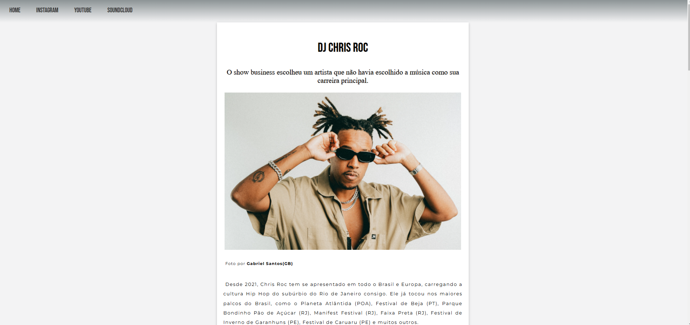

"Personal page"

>"Personal page created by me based on the knowledge learned in Modules 1 and 2 of the HTML and CSS course by Gustavo Guanabara."

### Adjustments and improvements

The project is still under development, and the next updates will focus on the following tasks:

- [ ] Embed YouTube videos
- [ ] SoundCloud music

### First Project 

 "This is my first project using only HTML and CSS for practice, and over time I will be updating it with the knowledge I’ve learned. I am open to receiving help and tips."
